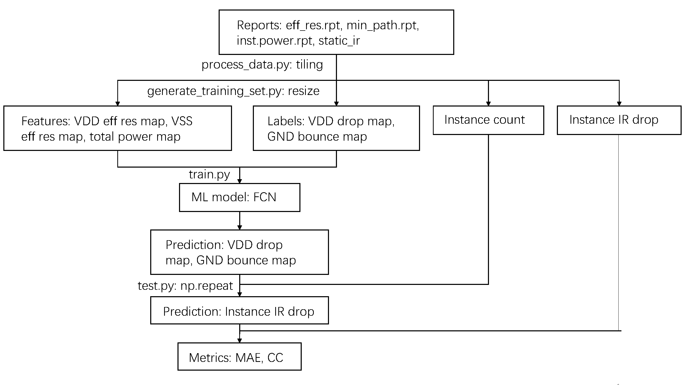

# Sample code for ICISC 2023 phlexing.

## Overview

This branch hosts the sample codes for ICISC 2023 Phlexing "Machine Learning driven Static IR drop estimation of SoC power grid network".

Use git checkout to switch to this branch.

```sh
git checkout icisc_2023
```


## Prerequisites

Dependencies can be installed using pip:

```sh
pip install -r requirements.txt
```

PyTorch is not included in requirement.txt, and you could install it following the instruction on PyTorch homepage [https://pytorch.org/](https://pytorch.org/).

Our experiments run on Python 3.9 and PyTorch 1.11. Also works on the environment on test server, which has Python 3.11 and PyTorch 2.0.

## IR Drop Prediction

Here is the flow chart of this sample code. This is just one implementation, you are encouraged to explore your own implementation.

<p align="center">
  
</p>

### Data Preparation

There are 2 sample data in /feature_extraction/data, which are the reports from GloryBolt, containing power, resistance and IR drop. We will use them for preprocessing and training.

Please run the following codes one by one under directory /feature_extraction.

Parsing the report and turn them into images (numpy array) through tiling.

```python
python process_data.py
```

Preprocessing the numpy array to facilitate model training.

```python
python generate_training_set.py
```

Generating the annotation csv to control the data allocation.

```python
python generate_csv.py
```

### Model Training and Testing.

We use a simple FCN as example, which takes in effective resistance and power, and output IR drop prediction.

Model Training (under directory /sample_model_training). Models and logs are saved in /work_dir (auto generated after training) by default.

```python
python train.py --args args/train.json
```

Model Testing. **Remember to modify the "--pretrained" argument to point to the model saved in /work_dir.**

```python
python test.py --args args/test.json --pretrained PATH_TO_SAVED_MODEL
```

Test results, including visualizations and report, are saved in /work_dir by default.


**The default setting use GPU, and if you don't have one, add "--cpu" argument.**

For example:
```python
python train.py --args args/train.json --cpu
```

## Change Log.
- 2023/11/6

  在/feature_extraction/process_data.py 和 /sample_model_training/test.py 中添加了final_test 这一argument。

  final_test=False:
  之前的测试流程, 使用了static_ir中的instance name信息, 以保证输出的report行数和golden的static_ir相同, 模型测试时可以直接计算metric。
        
  final_test=True:
  最终的测试流程中不提供staitc_ir这个文件, 并且不要求输出的report行数和golden的static_ir相同。此时可以使用power.rpt里的instance name信息，以输出report。模型测试时不直接计算metric，而另外用测试脚本(暂未发布)计算metric。

- 2023/11/3

  Update the format of the output file.

- 2023/9/22

  Update to include prediction for GND_bounce. 

- 2023/9/20

  Update to ensure compatibility with Windows and CPU.

- 2023/9/13

  First release.
  

