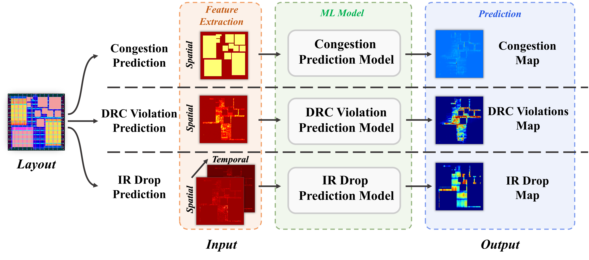

# CircuitNet: An Open-Source Dataset for Machine Learning Applications in Electronic Design Automation (EDA)

## Overview

This repository is intended to hosts codes and demos for CircuitNet, we hope this codebase would be helpful for users to reproduce exiting methods. More information about the dataset can be accessed from our web page [https://circuitnet.github.io/](https://circuitnet.github.io/).

<p align="center">
  
</p>

--------

## ChangeLog

- 2024/11/09

  Re-upload LEF/DEF, netlist and graph information to fix issue #38.

  Add demo for building graph with the graph_information in the dataset [here](https://github.com/circuitnet/CircuitNet/tree/main/build_graph_demo).
  
  Add section FAQ on web page.

  *Known issue(2024/12/16)*: some instance names in the DEF are wrong. The DEF will be re-upload later. A fixing script is uploaded [here](https://github.com/circuitnet/CircuitNet/tree/main/feature_extraction/fix_module_name_241216.py), and can be used to fix the issue in-situ. 


- 2023/7/24

  Code for feature extraction released. Users can use it to implement self-defined features with the LEF/DEF we released or extract features with LEF/DEF from other sources. Read the [REAME](https://github.com/circuitnet/CircuitNet/blob/main/feature_extraction/README.md) for more information.

- 2023/6/29

  Code for net delay prediction released. A simple tutorial on net delay prediction is added to [our website](https://circuitnet.github.io/tutorial/experiment_tutorial.html#Net_Delay).


- 2023/6/14

  The original dataset is renamed to CircuitNet-N28, and timing features are released.

  New dataset CircuitNet-N14 is released, supporting congestion, IR drop and timing prediction.

- 2023/3/22 

  LEF/DEF is updated to include tech information (sanitized). Each tarfile contains 500 DEF files and can be decompressed separately. We also provide example DEF files.
  
  Congestion features and graph features generated from ISPD2015 benchmark are available in the ISPD2015 dir.
  
- 2022/12/29 

  LEF/DEF (sanitized) are available in the LEF&DEF dir.

- 2022/12/12 

  Graph features are available in the graph_features dir.

- 2022/9/6 

  Pretrained weights are available in [Google Drive](https://drive.google.com/drive/folders/10PD4zNa9fiVeBDQ0-drBwZ3TDEjQ3gmf?usp=sharing) and [Baidu Netdisk](https://pan.baidu.com/s/1dUEt35PQssS7_V4fRHwWTQ?pwd=7i67).


- 2022/8/1 
  
  First release.


  
## Prerequisites

Dependencies can be installed using pip:

```sh
pip install -r requirements.txt
```

PyTorch is not included in requirement.txt, and you could install it following the instruction on PyTorch homepage [https://pytorch.org/](https://pytorch.org/).

DGL is also not included in requirement.txt, and it is required for net delay prediction only. You could install it following the instruction on DGL homepage [https://www.dgl.ai/pages/start.html](https://www.dgl.ai/pages/start.html).

Our experiments run on Python 3.9 and PyTorch 1.11. Other versions should work but are not tested.

## Congestion, DRC, IR drop prediction

### Data Preparation

Please follow the instructions on the [download page](https://circuitnet.github.io/intro/download.html) to set up the CircuitNet dataset for a specific task(Congestion/DRC/IR Drop).

CircuitNet-N28 download links: 

[Google Drive](https://drive.google.com/drive/u/1/folders/1GjW-1LBx1563bg3pHQGvhcEyK2A9sYUB) 

[Baidu Netdisk](https://pan.baidu.com/s/1udXVZnfjqniH9paKfyc2eQ?pwd=ijdh).

CircuitNet-N14 is currently maintained on Hugging Face and the download link is as follows:

[Hugging Face](https://huggingface.co/datasets/CircuitNet/CircuitNet/tree/main).


### Example Usage:

**Change the configure in [utils/config.py](utils/configs.py) to fit your file path and adjust hyper-parameter before starting.**

#### Test

##### Congestion

```python
python test.py --task congestion_gpdl --pretrained PRETRAINED_WEIGHTS_PATH
```

##### DRC

```python
python test.py --task drc_routenet --pretrained PRETRAINED_WEIGHTS_PATH --save_path work_dir/drc_routenet/ --plot_roc 
```

##### IR Drop

```python
python test.py --task irdrop_mavi --pretrained PRETRAINED_WEIGHTS_PATH --save_path work_dir/irdrop_mavi/ --plot_roc
```

#### Train

##### Congestion

```python
python train.py --task congestion_gpdl --save_path work_dir/congestion_gpdl/
```

##### DRC

```python
python train.py --task drc_routenet --save_path work_dir/drc_routenet/
```

##### IR Drop

```python
python train.py --task irdrop_mavi --save_path work_dir/irdrop_mavi/
```

## Net Delay prediction (DGL required)

### Data Preparation

Graphs for net delay prediction can be built with the following script:

```python
python build_graph.py --data_path DATA_PATH --save_path ./graph
```
where DATA_PATH is the path to the parent dir of the timing features: nodes, net_edges and pin_positions.

### Train

```python
python train.py --checkpoint CHECKPOINT_NAME
```
where CHECKPOINT_NAME is the name of the dir for saving checkpoint.
### Test

```python
python train.py --checkpoint CHECKPOINT_NAME --test_iter TEST_ITERATION
```
where TEST_ITERATION is the specific iteration for testing, corresponding to the saved checkpoint file name.

## License

This repository is released under the BSD 3-Clause. license as found in the LICENSE file.

## Citation

If you think our work is useful, please feel free to cite our [TCAD paper](https://ieeexplore.ieee.org/document/10158384)😆 and [ICLR paper](https://openreview.net/forum?id=nMFSUjxMIl).

```
@ARTICLE{10158384,
  author={Chai, Zhuomin and Zhao, Yuxiang and Liu, Wei and Lin, Yibo and Wang, Runsheng and Huang, Ru},
  journal={IEEE Transactions on Computer-Aided Design of Integrated Circuits and Systems}, 
  title={CircuitNet: An Open-Source Dataset for Machine Learning in VLSI CAD Applications with Improved Domain-Specific Evaluation Metric and Learning Strategies}, 
  year={2023},
  doi={10.1109/TCAD.2023.3287970}}
}

@inproceedings{
2024circuitnet,
title={CircuitNet 2.0: An Advanced Dataset for Promoting Machine Learning Innovations in Realistic Chip Design Environment},
author={Xun, Jiang and Chai, Zhuomin and Zhao, Yuxiang and Lin, Yibo and Wang, Runsheng and Huang, Ru},
booktitle={The Twelfth International Conference on Learning Representations},
year={2024},
url={https://openreview.net/forum?id=nMFSUjxMIl}
}

```

## Contact

For any questions, please do not hesitate to contact us.

```
Zhuomin Chai: zhuominchai@whu.edu.cn
Xun Jiang: xunjiang@stu.pku.edu.cn
Yuxiang Zhao: yuxiangzhao@stu.pku.edu.cn
Yibo Lin: yibolin@pku.edu.cn
```
