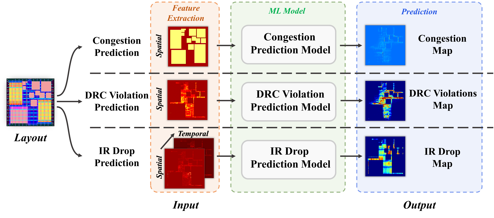

# CircuitNet: An Open-Source Dataset for Machine Learning Applications in Electronic Design Automation (EDA)

北京大学《电子信息学中的机器学习》2025年课程大作业代码，借助AI完成，仅供参考。

大作业文件在[course_project_congestion](course_project_congestion/)目录下，内有代码与[报告](course_project_congestion/report.pdf)。

## 适配50系显卡

首先确保安装好`nvidia-driver`和`cuda`，可以使用以下命令安装最新的`nvidia-driver`和`cuda`

```bash
wget https://developer.download.nvidia.com/compute/cuda/12.9.0/local_installers/cuda_12.9.0_575.51.03_linux.run
sudo sh cuda_12.9.0_575.51.03_linux.run
```

通过`nvidia-smi`命令和`nvcc -V`命令检查是否安装成功

然后安装`anaconda`，可以使用以下命令安装最新的`anaconda`

```bash
wget https://repo.anaconda.com/archive/Anaconda3-2024.10-1-Linux-x86_64.sh
bash Anaconda3-2024.10-1-Linux-x86_64.sh
```

创建`python=3.9`的conda虚拟环境，并激活

```bash
conda create -n circuitnet python=3.9
conda activate circuitnet
```

然后安装`pytorch`和`torchvision`，我使用的版本是`torch=2.7.0`，支持50系显卡。

```bash
conda install pip
pip3 install torch torchvision torchaudio --index-url https://download.pytorch.org/whl/cu128
```

接着拷贝当前项目，并安装除了`mmcv`以外的依赖（我已经在`requirements.txt`中注释了`mmcv`）

```bash
git clone -b congestion git@github.com:LHaiC/CircuitNet.git
cd CircuitNet
pip install -r requirements.txt
```

最后安装`mmcv`，可以使用以下命令安装最新的`mmcv`

```bash
pip install -U openmim
mim install mmcv=2.2.0
```

不过我用这个命令安装`mmcv`时报错了，所以我选择手动编译

```bash
git clone https://github.com/open-mmlab/mmcv.git
cd mmcv
pip install -r requirements/optional.txt
pip install -e . -v
```

编译完成后通过`python .dev_scripts/check_installation.py`命令检查是否安装成功，得到如下输出，说明安装成功

```bash
Start checking the installation of mmcv ...
CPU ops were compiled successfully.
CUDA ops were compiled successfully.
mmcv has been installed successfully.

Environment information:
------------------------------------------------------------
sys.platform: linux
Python: 3.9.21 (main, Dec 11 2024, 16:24:11) [GCC 11.2.0]
CUDA available: True
MUSA available: False
numpy_random_seed: 2147483648
GPU 0: NVIDIA GeForce RTX 5070 Ti
CUDA_HOME: /usr/local/cuda-12.9
NVCC: Cuda compilation tools, release 12.9, V12.9.41
GCC: gcc (Ubuntu 13.3.0-6ubuntu2~24.04) 13.3.0
PyTorch: 2.7.0+cu128
PyTorch compiling details: PyTorch built with:
  - GCC 11.2
  - C++ Version: 201703
  - Intel(R) oneAPI Math Kernel Library Version 2024.2-Product Build 20240605 for Intel(R) 64 architecture applications
  - Intel(R) MKL-DNN v3.7.1 (Git Hash 8d263e693366ef8db40acc569cc7d8edf644556d)
  - OpenMP 201511 (a.k.a. OpenMP 4.5)
  - LAPACK is enabled (usually provided by MKL)
  - NNPACK is enabled
  - CPU capability usage: AVX512
  - CUDA Runtime 12.8
  - NVCC architecture flags: -gencode;arch=compute_75,code=sm_75;-gencode;arch=compute_80,code=sm_80;-gencode;arch=compute_86,code=sm_86;-gencode;arch=compute_90,code=sm_90;-gencode;arch=compute_100,code=sm_100;-gencode;arch=compute_120,code=sm_120;-gencode;arch=compute_120,code=compute_120
  - CuDNN 90.7.1
  - Magma 2.6.1
  - Build settings: BLAS_INFO=mkl, BUILD_TYPE=Release, COMMIT_SHA=134179474539648ba7dee1317959529fbd0e7f89, CUDA_VERSION=12.8, CUDNN_VERSION=9.7.1, CXX_COMPILER=/opt/rh/gcc-toolset-11/root/usr/bin/c++, CXX_FLAGS= -D_GLIBCXX_USE_CXX11_ABI=1 -fvisibility-inlines-hidden -DUSE_PTHREADPOOL -DNDEBUG -DUSE_KINETO -DLIBKINETO_NOROCTRACER -DLIBKINETO_NOXPUPTI=ON -DUSE_FBGEMM -DUSE_PYTORCH_QNNPACK -DUSE_XNNPACK -DSYMBOLICATE_MOBILE_DEBUG_HANDLE -O2 -fPIC -Wall -Wextra -Werror=return-type -Werror=non-virtual-dtor -Werror=range-loop-construct -Werror=bool-operation -Wnarrowing -Wno-missing-field-initializers -Wno-unknown-pragmas -Wno-unused-parameter -Wno-strict-overflow -Wno-strict-aliasing -Wno-stringop-overflow -Wsuggest-override -Wno-psabi -Wno-error=old-style-cast -fdiagnostics-color=always -faligned-new -Wno-maybe-uninitialized -fno-math-errno -fno-trapping-math -Werror=format -Wno-stringop-overflow, LAPACK_INFO=mkl, PERF_WITH_AVX=1, PERF_WITH_AVX2=1, TORCH_VERSION=2.7.0, USE_CUDA=ON, USE_CUDNN=ON, USE_CUSPARSELT=1, USE_GFLAGS=OFF, USE_GLOG=OFF, USE_GLOO=ON, USE_MKL=ON, USE_MKLDNN=ON, USE_MPI=OFF, USE_NCCL=1, USE_NNPACK=ON, USE_OPENMP=ON, USE_ROCM=OFF, USE_ROCM_KERNEL_ASSERT=OFF,

TorchVision: 0.22.0+cu128
OpenCV: 4.6.0
MMEngine: 0.10.7
MMCV: 2.2.0
MMCV Compiler: GCC 13.3
MMCV CUDA Compiler: 12.9
------------------------------------------------------------
```

最后回到`CircuitNet/routability_ir_drop_prediction`目录下，运行`python test.py`命令测试是否安装成功，得到如下输出，说明安装成功

```bash
===> Loading datasets
===> Building model
100%|███████████████████████████████████████████████████████████████████████████████| 3164/3164 [03:30<00:00, 15.04it/s]
===> Avg. NRMS: 0.3853
===> Avg. SSIM: 0.2888
===> Avg. EMD: 0.0052
```

## Overview

This repository is intended to hosts codes and demos for CircuitNet, we hope this codebase would be helpful for users to reproduce exiting methods. More information about the dataset can be accessed from our web page [https://circuitnet.github.io/](https://circuitnet.github.io/).

<p align="center">
  
</p>

--------

## ChangeLog

- 2024/11/09

  Re-upload LEF/DEF, netlist and graph information to fix issue #38.

  Add demo for building graph with the graph_information in the dataset [here](https://github.com/circuitnet/CircuitNet/tree/main/build_graph_demo).
  
  Add section FAQ on web page.

  *Known issue(2024/12/16)*: some instance names in the DEF are wrong. The DEF will be re-upload later. A fixing script is uploaded [here](https://github.com/circuitnet/CircuitNet/tree/main/feature_extraction/fix_module_name_241216.py), and can be used to fix the issue in-situ. 


- 2023/7/24

  Code for feature extraction released. Users can use it to implement self-defined features with the LEF/DEF we released or extract features with LEF/DEF from other sources. Read the [REAME](https://github.com/circuitnet/CircuitNet/blob/main/feature_extraction/README.md) for more information.

- 2023/6/29

  Code for net delay prediction released. A simple tutorial on net delay prediction is added to [our website](https://circuitnet.github.io/tutorial/experiment_tutorial.html#Net_Delay).


- 2023/6/14

  The original dataset is renamed to CircuitNet-N28, and timing features are released.

  New dataset CircuitNet-N14 is released, supporting congestion, IR drop and timing prediction.

- 2023/3/22 

  LEF/DEF is updated to include tech information (sanitized). Each tarfile contains 500 DEF files and can be decompressed separately. We also provide example DEF files.
  
  Congestion features and graph features generated from ISPD2015 benchmark are available in the ISPD2015 dir.
  
- 2022/12/29 

  LEF/DEF (sanitized) are available in the LEF&DEF dir.

- 2022/12/12 

  Graph features are available in the graph_features dir.

- 2022/9/6 

  Pretrained weights are available in [Google Drive](https://drive.google.com/drive/folders/10PD4zNa9fiVeBDQ0-drBwZ3TDEjQ3gmf?usp=sharing) and [Baidu Netdisk](https://pan.baidu.com/s/1dUEt35PQssS7_V4fRHwWTQ?pwd=7i67).


- 2022/8/1 
  
  First release.


  
## Prerequisites

Dependencies can be installed using pip:

```sh
pip install -r requirements.txt
```

PyTorch is not included in requirement.txt, and you could install it following the instruction on PyTorch homepage [https://pytorch.org/](https://pytorch.org/).

DGL is also not included in requirement.txt, and it is required for net delay prediction only. You could install it following the instruction on DGL homepage [https://www.dgl.ai/pages/start.html](https://www.dgl.ai/pages/start.html).

Our experiments run on Python 3.9 and PyTorch 1.11. Other versions should work but are not tested.

## Congestion, DRC, IR drop prediction

### Data Preparation

Please follow the instructions on the [download page](https://circuitnet.github.io/intro/download.html) to set up the CircuitNet dataset for a specific task(Congestion/DRC/IR Drop).

CircuitNet-N28 download links: 

[Google Drive](https://drive.google.com/drive/u/1/folders/1GjW-1LBx1563bg3pHQGvhcEyK2A9sYUB) 

[Baidu Netdisk](https://pan.baidu.com/s/1udXVZnfjqniH9paKfyc2eQ?pwd=ijdh).

CircuitNet-N14 is currently maintained on Hugging Face and the download link is as follows:

[Hugging Face](https://huggingface.co/datasets/CircuitNet/CircuitNet/tree/main).


### Example Usage:

**Change the configure in [utils/config.py](utils/configs.py) to fit your file path and adjust hyper-parameter before starting.**

#### Test

##### Congestion

```python
python test.py --task congestion_gpdl --pretrained PRETRAINED_WEIGHTS_PATH
```

##### DRC

```python
python test.py --task drc_routenet --pretrained PRETRAINED_WEIGHTS_PATH --save_path work_dir/drc_routenet/ --plot_roc 
```

##### IR Drop

```python
python test.py --task irdrop_mavi --pretrained PRETRAINED_WEIGHTS_PATH --save_path work_dir/irdrop_mavi/ --plot_roc
```

#### Train

##### Congestion

```python
python train.py --task congestion_gpdl --save_path work_dir/congestion_gpdl/
```

##### DRC

```python
python train.py --task drc_routenet --save_path work_dir/drc_routenet/
```

##### IR Drop

```python
python train.py --task irdrop_mavi --save_path work_dir/irdrop_mavi/
```

## Net Delay prediction (DGL required)

### Data Preparation

Graphs for net delay prediction can be built with the following script:

```python
python build_graph.py --data_path DATA_PATH --save_path ./graph
```
where DATA_PATH is the path to the parent dir of the timing features: nodes, net_edges and pin_positions.

### Train

```python
python train.py --checkpoint CHECKPOINT_NAME
```
where CHECKPOINT_NAME is the name of the dir for saving checkpoint.
### Test

```python
python train.py --checkpoint CHECKPOINT_NAME --test_iter TEST_ITERATION
```
where TEST_ITERATION is the specific iteration for testing, corresponding to the saved checkpoint file name.

## License

This repository is released under the BSD 3-Clause. license as found in the LICENSE file.

## Citation

If you think our work is useful, please feel free to cite our [TCAD paper](https://ieeexplore.ieee.org/document/10158384)😆 and [ICLR paper](https://openreview.net/forum?id=nMFSUjxMIl).

```
@ARTICLE{10158384,
  author={Chai, Zhuomin and Zhao, Yuxiang and Liu, Wei and Lin, Yibo and Wang, Runsheng and Huang, Ru},
  journal={IEEE Transactions on Computer-Aided Design of Integrated Circuits and Systems}, 
  title={CircuitNet: An Open-Source Dataset for Machine Learning in VLSI CAD Applications with Improved Domain-Specific Evaluation Metric and Learning Strategies}, 
  year={2023},
  doi={10.1109/TCAD.2023.3287970}}
}

@inproceedings{
2024circuitnet,
title={CircuitNet 2.0: An Advanced Dataset for Promoting Machine Learning Innovations in Realistic Chip Design Environment},
author={Xun, Jiang and Chai, Zhuomin and Zhao, Yuxiang and Lin, Yibo and Wang, Runsheng and Huang, Ru},
booktitle={The Twelfth International Conference on Learning Representations},
year={2024},
url={https://openreview.net/forum?id=nMFSUjxMIl}
}

```

## Contact

For any questions, please do not hesitate to contact us.

```
Zhuomin Chai: zhuominchai@whu.edu.cn
Xun Jiang: xunjiang@stu.pku.edu.cn
Yuxiang Zhao: yuxiangzhao@stu.pku.edu.cn
Yibo Lin: yibolin@pku.edu.cn
```
